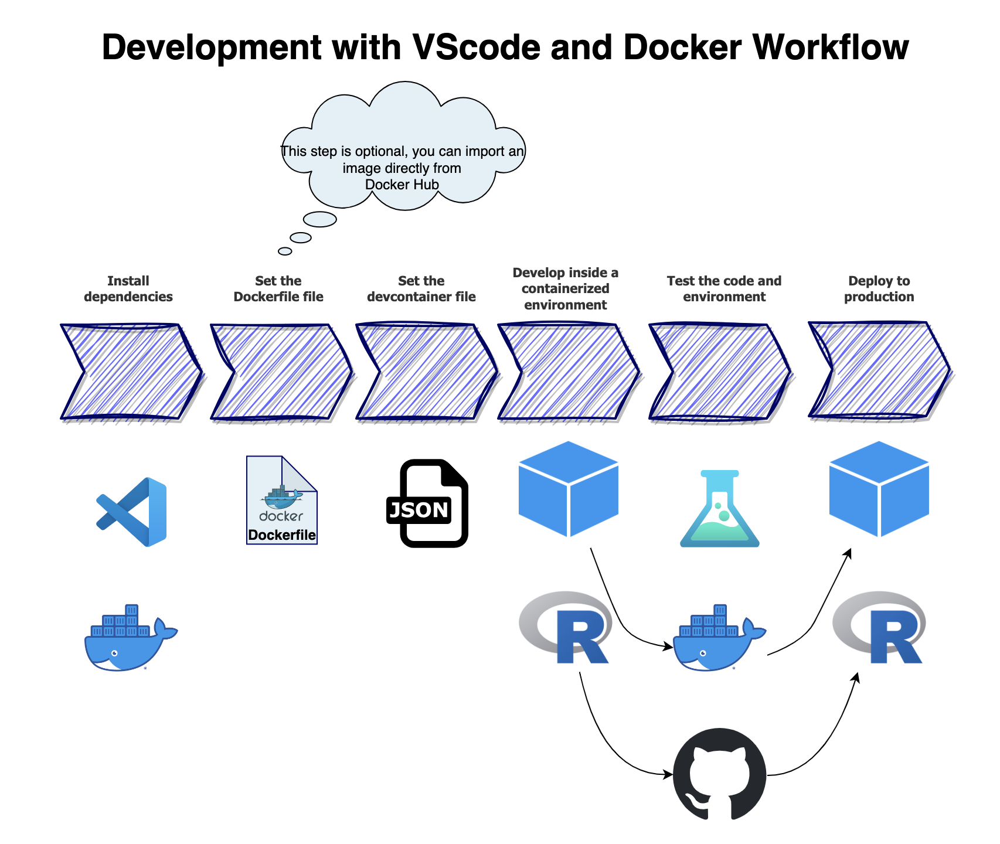
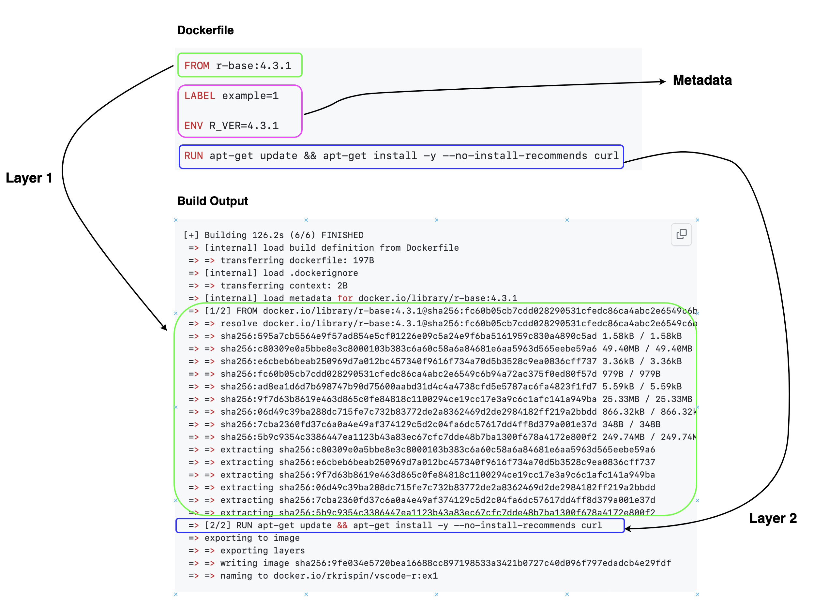
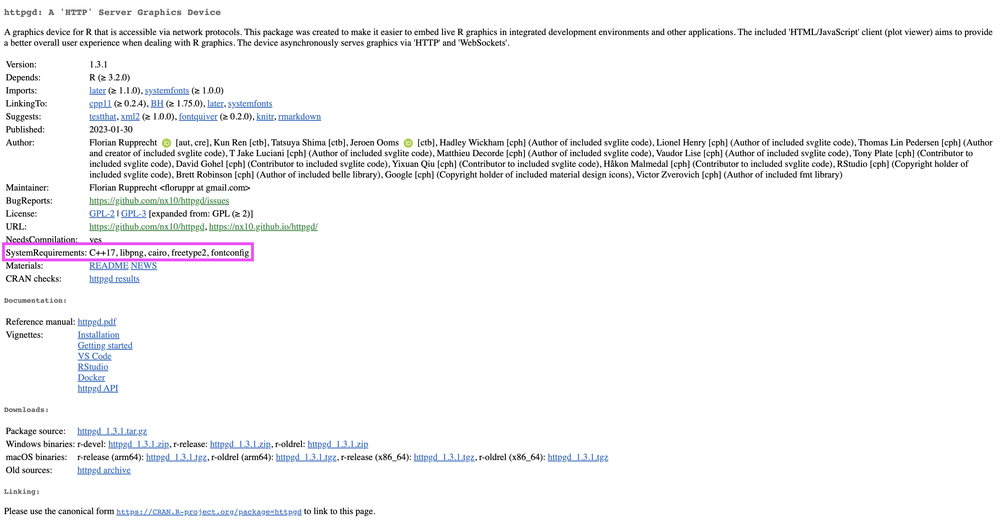
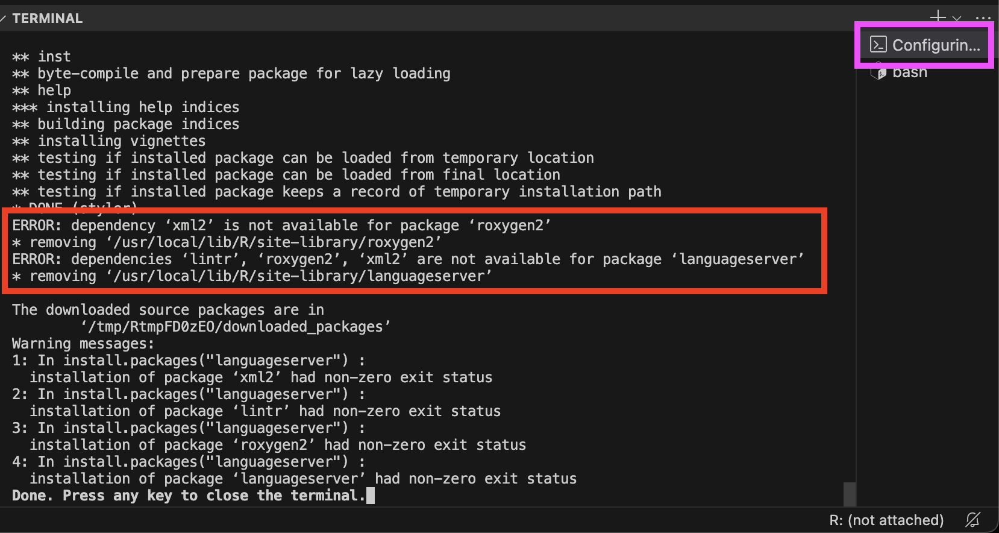
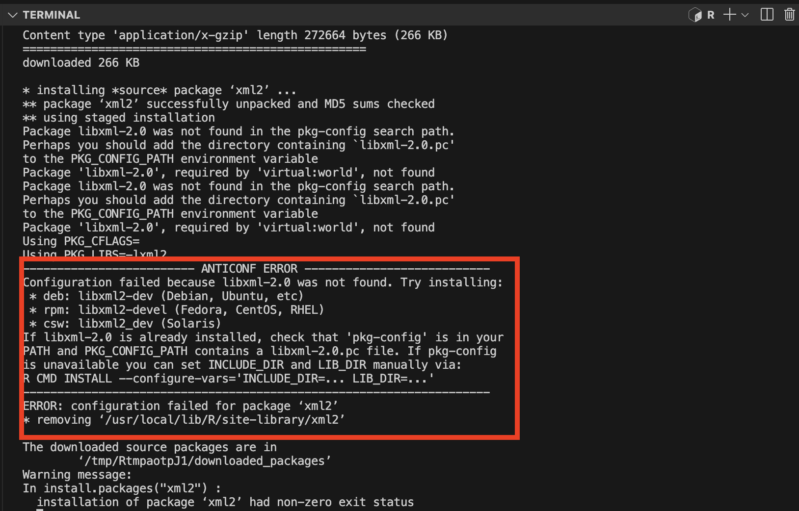
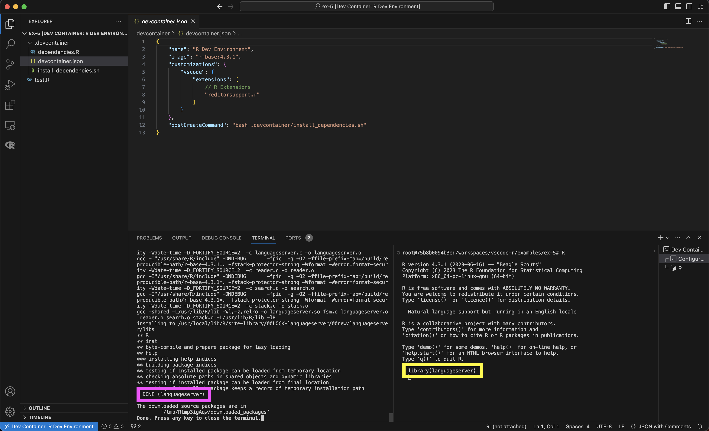
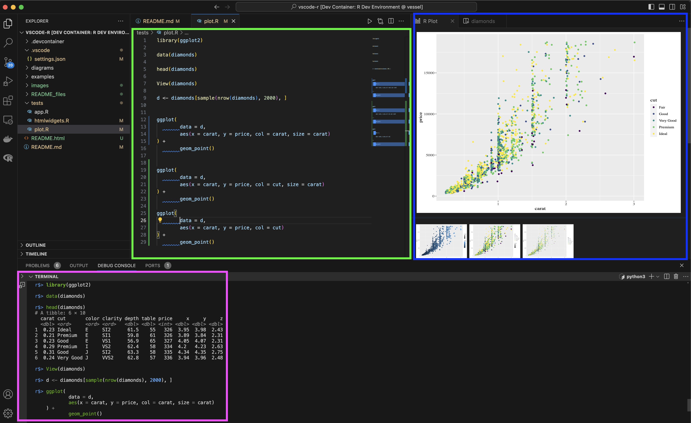
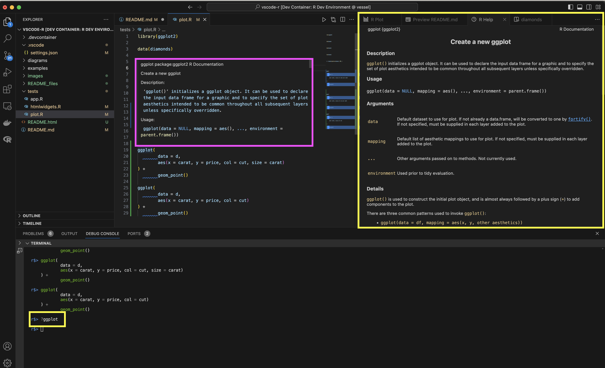
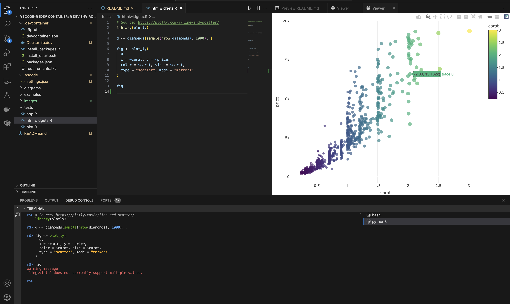
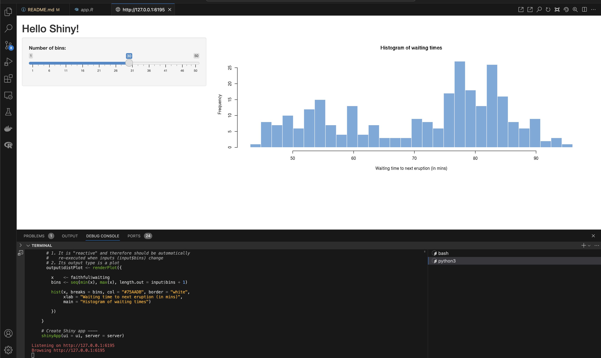

# Setting up an R Development Environment with VScode and Docker


This repo provides a step-by-step guide and a template for setting up an R development environment with VScode and Docker 🐳. Docker is an amazing tool, but it has some learning curve. This tutorial aims to reduce the entry barrier for learning tools such as Docker.

See also:
- [Setting up a Python Development Environment with VScode and Docker](https://github.com/RamiKrispin/vscode-python)
- [Running Python/R with Docker vs. Virtual Environment](https://medium.com/@rami.krispin/running-python-r-with-docker-vs-virtual-environment-4a62ed36900f)
- [Deploy Flexdashboard on Github Pages with Github Actions and Docker](https://github.com/RamiKrispin/deploy-flex-actions)
- [Docker for Data Scientists 🐳](https://github.com/RamiKrispin/Introduction-to-Docker) (WIP) 


<figure>
</a>
<figcaption> Figure 1 - A dockerized R environment with VScode and the Dev Containers extension </figcaption>

</figure>

<br>
<br />

### Open Issues

- CRAN mirror settings do not load from the `.Rprofile`, see this open [issue](https://github.com/RamiKrispin/vscode-r/issues/10)
- Future enhancements are available [here](https://github.com/RamiKrispin/vscode-r/issues/11)


Table of Contents:

* [Motivation](https://github.com/RamiKrispin/vscode-r#motivation)
* [Scope](https://github.com/RamiKrispin/vscode-r#scope)
* [Prerequisites](https://github.com/RamiKrispin/vscode-r#prerequisites)
* [General Architecture and Workflow](https://github.com/RamiKrispin/vscode-r#general-architecture-and-workflow)
* [The Rocker Project](https://github.com/RamiKrispin/vscode-r#the-rocker-project)
* [Getting Started with Docker](https://github.com/RamiKrispin/vscode-r#getting-started-with-docker)
* [Running R on Docker - the Hard Way](https://github.com/RamiKrispin/vscode-r#running-r-on-docker---the-hard-way)
* [Setting R Development Environment with VScode](https://github.com/RamiKrispin/vscode-r#setting-r-development-environment-with-vscode)
* [Setting the Dev Containers Extension](https://github.com/RamiKrispin/vscode-r#setting-the-dev-containers-extension)
* [Setting the R Environment](https://github.com/RamiKrispin/vscode-r#setting-the-r-environment)
* [Running R with VScode](https://github.com/RamiKrispin/vscode-r#running-r-with-vscode)
* [Summary](https://github.com/RamiKrispin/vscode-r#summary)
* [Resources](https://github.com/RamiKrispin/vscode-r#resources)
* [License](https://github.com/RamiKrispin/vscode-r#license)


## Motivation

This section focuses on the advantages of using Docker with VScode and explains the motivation for using R with VScode.

### Why develop with Docker 🐳?

Docker is a CI/CD tool that enables seamless code deployment from development to production environments. By creating OS-level virtualization, it can package an application and its dependencies in a virtual container and ship it between different environments. The main advantages of using Docker within your development environment are:
- **Reproducibility -** Docker enables you to seamlessly package your code and its dependencies into a single container and execute, test, share, and deploy it with a high level of consistency
- **Collaboration -** Docker solves the dependencies madness when a team of developers works together on a specific project. Having a unified environment saves a ton of time during the development step. For example, if one developer gets some error, it is easy for other developers to reproduce the error and help debug it
- **Deployment -** Docker simplifies the code shipment from the development environment to the production

While Docker usually rhymes with DevOps and CI/CD, it is a great tool for data science and engineering applications, in particular, MLOps. 

One of the core foundations of data science is the ability to reproduce your work, regardless of the user or machine the job is running. This is where Docker is shining by solving the lack of consistency between environments that cause many of us pain and grief. 

In addition, Docker as a CI/CD tool plays a pivotal role in MLOps as it enables seamless deployment of data science and engineering applications such as data pipelines and automation, model deployment, etc.

### Why VScode 💻?

VScode (aka Visual Studio Code) is a general-purpose free code editor developed by Microsoft. It can be run locally on Windows, macOS, and Linux OSs or on a cloud environment. The main advantages of using VScode as your IDE are:
- **Multi-languages -** VScode supports out-of-the-box JavaScript, TypeScript, and Node.js, and has a variety of extensions that enable running other programming languages such as Python, C++, C#, Go, etc.
- **Extensions -** VScode has a large community support that builds and maintains a variety of extensions that extend the editor's capabilities and functionality. That includes extensions that support programming languages (such as Python, R, and Julia), plugs-in that enables connection with external applications (Docker, Postgres, etc.), and other applications
- **Git integration -** VScode has built-in integration with Git
- **Docker integration -** VScode supports natively Docker integration, which we will dive deep into in the coming sections

The main advantage of VScode is the native Docker integration, which enables the opening of a project in a containerized environment. In addition, in many senses, VScode is a DIY IDE that enables a high level of freedom of customization. On the other hand, the downside of VScode is that for most programming languages, VScode will not be an "out-of-box" IDE. It requires both knowledge and some level of effort to customize it to work with languages such as Python, R, etc.


### Why R with VScode?!?

After we discussed Docker and VScode, it is time to address the elephant in the room - why use R with VScode when you have such a great IDE for R - RStudio? The short answer is Docker. 

If Docker is not part of your workflow, you are more than welcome to continue reading this tutorial and learn how to run R with VScode, but RStudio would be the best IDE for you. 

On the other hand, if Docker is part of your workflow (or you wish to adopt it), it is worth, in my opinion, the effort of customizing VScode to run R. Besides running your code inside a dockerized environment, VScode has additional advantages:
- A variety of extensions and add-ons, such as tools for documentation (Draw.io, Markdown, Quarto, etc.), databases (Postgres, Snowflake, etc.), and other utility tools (JSON, YAML viewers, etc.)
- Support for multiple languages such as JS, HTML, Python, Bash, etc.

Last but not least, to set expectations before starting, even with all the awesome extensions and customization we can use to set R, it won't feel as native as RStudio. It's just different.

**Note:** While RStudio does not support Docker, you can run an RStudio Server inside a dockerized environment. This approach required some level of customization, but the use of this is under the AGPL-3 license.


## Scope

This tutorial focuses on setting up a dockerized R development environment with VScode. We will explore how to integrate VScode with Docker using Microsoft's Dev Container extensions and show various methods for configuring an R environment with Docker. That includes the following settings:
- Set a template for a dockerized R environment
- Define environment variables
- Set a code editor and debugger
- Set support for Shiny, Quarto, htmlwidgets, plots, table viewer, etc.
- Enable to launch multiple R sessions in parallel
- Set code snippet

However, it's important to note that while this tutorial covers some of the core Docker features, it is not a complete Docker guide. If you don't have previous experience with Docker, I highly recommend taking one of the Docker crash courses.


## Prerequisites

Generally, this tutorial does not require previous experience with Docker and VScode. In line with the tutorial scope above, the goal is to teach you how to set up an R development environment using Docker and VScode. That being said, as mentioned above, you will benefit more from and highly utilize this tutorial if you take some Docker intro courses before starting this tutorial.
The main requirements for this tutorial are setting VScode and Docker Desktop. In addition, you will need to set up an account with Docker Hub.

### Installing VScode

Installing VScode is straightforward - go to the VScode website https://code.visualstudio.com/ and click on the Download button (purple rectangle on the screenshot):
<figure>
</a>
<figcaption> Figure 2 - Visual Studio Code download page</figcaption>
</figure>
<br>
<br />

Download the installation file and follow the instructions. 

To set a dockerized environment in VScode we will need to install the [Dev Containers](https://marketplace.visualstudio.com/items?itemName=ms-vscode-remote.remote-containers) extension, which enables to open a folder and execute a code inside a Docker container.

Here is how to install an extension on VScode: 
- Click the Extensions button on the left menu (mark with a purple arrow on the screenshot below) 
- Type the extension name on the search menu (see the yellow rectangular). You can see the search results below, and clicking on each extension will open a window with the extension details. 
- Last but not least, Click the install button (see the green rectangular) to install the extension
<figure>
</a>
<figcaption> Figure 3 - Steps to install extension on VScode</figcaption>
</figure>
<br>
<br />

**Note:** The Dev Containers extension is required to launch the dockerized environment. We will see later in this tutorial how to set and install the necessary extensions for your dockerized environment automatically with the `devcontainer.json` file.

### Setting Docker
Various ways exist to build and run Docker images on different operations systems. For the purpose of this guide, we will be utilizing Docker Desktop. It is a user-friendly container management interface that is compatible with MacOS, Windows, and Linux operating systems.

**Note:** Docker Desktop is free for personal use but requires a license for commercial use. For further information, please refer to https://www.docker.com/pricing/.

To install Docker Desktop, go to Docker website and follow the installation instructions according to your OS:
<figure>
 </a>
<figcaption> Figure 4 - Docker Desktop download page</figcaption>
</figure>

<br>
<br />

### Docker Hub

Container Registry has a similar functionality as Github for code, and it uses to store and share images. There are many container registries, and the most common is  Docker Hub. We will use throughout the tutorial Docker Hub to pull different images, such as R and Python images or OS base images such as Ubuntu. To register and create an account go to https://hub.docker.com and follow the registration instructions.

After installing Docker Desktop and setting account on Docker Hub, open Docker Desktop, and from the command line, login to Docker Hub:

``` shell
 docker login
```

You will have to enter your username and password, and you should expect the following output if the login is successful:

``` shell
Login with your Docker ID to push and pull images from Docker Hub. If you don't have a Docker ID, head over to https://hub.docker.com to create one.
Username: rkrispin
Password:
Login Succeeded

Logging in with your password grants your terminal complete access to your account.
For better security, log in with a limited-privilege personal access token. Learn more at https://docs.docker.com/go/access-tokens/
```
**Note:**  Docker Hub is completely public (for the free tier). Any image you push and store there will be available for all other users. Regardless if your container registry is public or not, **NEVER** store credentials, passwords, or any other sensitive information on your Docker images. 


### Hello World!

There is no better way to test if Docker was installed properly than by running whalesay (or 🐳  say) Docker's most `Hello World!` common example. The whalesay is an adaption of the Linux cowsay (🐮 say) game using a whale instead of a cow to print some text. Let's run the below code from the terminal to print `Hello R Users! 👋 😎`:

``` shell
docker run docker/whalesay cowsay Hello R Users! 👋 😎
```
If this is the first time you are using Docker or your first time using the `whalesay` image you should expect the following message:

``` shell
Unable to find image 'docker/whalesay:latest' locally
```

That is a generic message that notifies that the requested image cannot be found locally, and Docker will try to pull the image from the hub (if specified) and follow by downloading the image:


``` shell
latest: Pulling from docker/whalesay
Image docker.io/docker/whalesay:latest uses outdated schema1 manifest format. Please upgrade to a schema2 image for better future compatibility. More information at https://docs.docker.com/registry/spec/deprecated-schema-v1/
e190868d63f8: Pull complete
909cd34c6fd7: Pull complete
0b9bfabab7c1: Pull complete
a3ed95caeb02: Pull complete
00bf65475aba: Pull complete
c57b6bcc83e3: Pull complete
8978f6879e2f: Pull complete
8eed3712d2cf: Pull complete
Digest: sha256:178598e51a26abbc958b8a2e48825c90bc22e641de3d31e18aaf55f3258ba93b
Status: Downloaded newer image for docker/whalesay:latest
```

And this is the expected output:

``` shell
__________________________
< Hello R Users! 👋 😎 >
 --------------------------
    \
     \
      \
                    ##        .
              ## ## ##       ==
           ## ## ## ##      ===
       /""""""""""""""""___/ ===
  ~~~ {~~ ~~~~ ~~~ ~~~~ ~~ ~ /  ===- ~~~
       \______ o          __/
        \    \        __/
          \____\______/
```

If you are able to run the `whalesay` app you are ready to get started with Docker.

## General Architecture and Workflow

Before diving into the core functionality of Docker, let's review the generic development workflow architecture with Docker. Docker has similar functionality as Git and Github (or Gitlab, Bitbucket, etc.), enabling shifting your environment and settings (as opposed to code with Git) from one environment to another one (e.g., dev -> staging or dev -> prod) ensuring a high level of reproducibility. As a matter of fact those two (Docker and Git) go together side by side.


### General architecture

The diagram below describes a high-level architecture of a Dockerized development environment with VScode. It might be overwhelming if you have never used Docker before, and it will make more sense (I hope) by the end of this section.
<figure>
</a>
<figcaption> Figure 5 - Development workflow with VScode and Docker</figcaption>
</figure>

<br>
<br />


This process includes the following components:
- **Dev Container** - is the VScode extension that enables you to execute your local code inside a dockerized environment seamlessly. By default, it mounts your local folder to the docker environment ensuring your code runs inside the container and lives locally.
- **devcontainer.json** - is the Dev Container configuration file that enables you to highly customize your VScode development environment when using the Dev Container extension. From settings the VScode options (e.g., fonts, list of extensions to install, etc.) to the Docker settings (similar to the docker-compose.yml file functionality)
- **Dockerfile** - is the image manifest or recipe. It provides instructions for the docker engine about which base image to use and what components to install. Typically, you start the build process by importing some base image using the `FROM` command, which we will explain later in this tutorial. The Dev Container extension enables you to build the image on the fly when launching the environment using the Dockerfile or import a built-in image from some image registry such as Docker Hub.
- **Image registry** - has similar functionality as Github / Gitlab / Bitbucket, and it is used to store public images (or private on some enterprise versions). The image registry lets you shift and distribute your images from one environment to another. In this tutorial, we will use the main image registry - Docker Hub. 
- **Code registry** - beyond version control, it enables you to shift your code from one environment to another. In this tutorial, we will use Github as our code registry.

**Note:** Regardless if you are using a private or public image registry, as a good practice, you should **NEVER** store passwords, credentials, or any sensitive information on your images. Rather, add environment variables or load information from a mounted volume during the image run time.

### Development workflow
Let's now organize and order this process to a general workflow. The below diagram defines a general order of operation for the development process applying the following steps:
- **Install dependencies** - setting the prerequisites, including installing VScode and the required extensions (e.g., Dev Container, etc.), installing Docker, and setting a Docker Hub account (or equivalent)
- **Set the Dockerfile** - this step is optional, if you wish to build your image on the fly. Alternatively, you can import a built-in image from an image registry and skip this step. In the next section, we will dive into more details about the core functionality of the Dockerfile and how to set it
- **Set the devcontainer.json file** - this file defines the environment and enables you to customize both the VScode functionality and VScode settings. Later in this tutorial, we will see how to set this file
- **Development** - once the `devcontainer.json` file is set, you can launch your dockerized development environment using the Dev Container extension on your local folder. 
- **Testing** - this is a recommended intermediate step before shipping your code and environment to deployment. There are multiple approaches to code and environment testing, and the main goal is to ensure that your code sync with the dockerized environment and identify potential problems before deploying it.
- **Deployment** - last but not least, using code and container registry (e.g., Github and Docker Hub), we can deploy our code using the same dockerized environment to some remote server (e.g., Github Actions, AWS, GCP, Azure, etc.) or have your peers run your code in their computer. 


<figure>
</a>
<figcaption> Figure 6 - Development with VScode and Docker workflow</figcaption>
</figure>

<br>
<br />


## The Rocker Project

The [Rocker project](https://rocker-project.org/) is the main hub for built-in R images. The project was created by Carl Boettiger and Dirk Eddelbuettel, and is now maintained by Carl, Dirk, Noam Ross, and SHIMA Tatsuya. The project provides a variety of R images, such as:
- [Base R](https://hub.docker.com/_/r-base) - a basic image with R installed. There is a corresponding image to most of the recent R versions
- [RStudio Server](https://hub.docker.com/r/rocker/rstudio/tags) - a built-in image with RStudio server installed
- Different R package settings - built-in images with different ecosystems installed, such as the [tidyverse](https://hub.docker.com/r/rocker/tidyverse), [verse](https://hub.docker.com/r/rocker/verse), [geospatial](https://hub.docker.com/r/rocker/geospatial), [Shiny](https://hub.docker.com/r/rocker/shiny), [Shiny with tidyverse](https://hub.docker.com/r/rocker/shiny-verse/tags), etc.
https://hub.docker.com/r/rocker/shiny-verse/tags

The main advantages of using images from the Rocker project as base images are:
- Robust and tested
- Community support
- Comes with R's core dependencies (Debian packages, etc.) 


As mentioned above, you can run RStudio inside a container using a containerized RStudio Server. The Rocker project provides a built-in and ready to use images with RStudio Server. While it is not in the scope of this tutorial, it is a good alternative for VScode with the following limitations:
- It is under an AGPL-3 license and therefore, cannot be used for enterprise
- Required some additional modifications and settings (e.g., mount local folders, git, etc.)

In this tutorial we will leverage some images from the Rocker project (base R, etc.) as our baseline images.

In the next section, we review Docker basic commands and learn how to set a Dockerfile. 

## Getting Started with Docker
Generally, the VScode **Dev Container** extension lets you containerize your environment by importing a built-in image. However, often, you may want to add more layers (e.g., install additional dependencies) or build it yourself. This section focuses on the essential Docker requirements that will enable you to build your image and run it inside a container:

- **Dockerfile** - the image recipe, allows you to add components and customize the dependencies according to the development environment requirements  
- **Docker CLI** - core commands to build the image and run it as a containerized environment 

<figure>
</a>
<figcaption> Figure 7 - Docker general workflow</figcaption>
</figure>

<br>
<br />

**Note:** It is important to emphasize that this section covers the basic Docker requirements for this tutorial and is not an alternative to a full Docker tutorial or course. 


### The Dockerfile
The `Dockerfile` provides a set of instructions for the Docker engine about how to build the image. You can think about it as the image's recipe. It has its own unique and intuitive syntax using the following structure:

``` Dockerfile
COMMAND some instructions
```

For example, the following `Dockerfile` imports a built-in image with base R (version 4.3.1) from the [Rocker project](https://hub.docker.com/r/rocker/r-base) and then using the `apt-get update` and `apt-get install` to install the `curl` library :


`./examples/ex-1/Dockerfile`
``` Dockerfile
FROM r-base:4.3.1

LABEL example=1

ENV R_VER=4.3.1

RUN apt-get update && apt-get install -y --no-install-recommends curl
```

In a nutshell, we used the `FROM` command to specify the image we want to import from the Docker registry (don't forget to login to the Docker registry service you are using before building the image!). The `LABEL` command is used to set labels or comments, and the `ENV` command is to set environment variables. Last but not least, the `RUN` command is used to run a command on the command line, in this case, to install the `curl` library.

Let's now review the Dockerfile core commands:
- `FROM` - Defines the base image to use for the image's build. In most cases, unless you are building the image from scratch, you will use some base image with some pre-installed OS and some dependencies. For example, in this tutorial, we will import as our base image the official [Ubuntu image]()
- `LABEL` - Enables to add information about the image to the image's metadata, such as authors, maintainers, license, etc.
- `ENV` - Uses to set environment variables
- `ARG` - Enables to set parameters during the build time
- `RUN` -  Allows executing CLI commands (e.g., `pip install ...`, `apt-get ...`, `apt-install...`, `wget...`, etc.) during the build time to add additional components to the base image
- `COPY` - Enables to copy objects (e.g., files and folders) from your local system to the image 
- `WORKDIR` - Sets the working directory inside the image
- `EXPOSE` - Defines the port number to expose the image during the run time
- `CMD` - Sets a default command to execute during the run time of the image
- `ENDPOINT` - Allows configuring a container that will run as an executable

### Docker Build

Once the `Dockerfile` is ready, the next step is to build the image using the  `docker build` command from the command line. For example, let's build the above `Dockerfile` using the `build` command from this repo root folder:

``` shell
docker build . -f ./examples/ex-1/Dockerfile -t rkrispin/vscode-r:ex1 
```

Here are the arguments we used with the `build` command:
- The `-f` tag defines the `Dockerfile` path. This argument is optional and should be used if you are calling the `build` function from a different folder than one of the `Dockerfile`
- The `.` symbol defines the context folder of the files system as the one of the `Dockerfile`. Although we did not use the file system in this case, this enables us in other cases to call and copy files from our local folder to the image during the build time
- The `-t` is used to set the image's name and tag (e.g., version). In this case, the image name is `rkrispin/vscode-r` and the tag is `ex1`. 


You should expect the following output:

``` shell
[+] Building 91.2s (6/6) FINISHED                                                                                                                                                          
 => [internal] load build definition from Dockerfile                                                                                                                                  0.1s
 => => transferring dockerfile: 197B                                                                                                                                                  0.0s
 => [internal] load .dockerignore                                                                                                                                                     0.2s
 => => transferring context: 2B                                                                                                                                                       0.0s
 => [internal] load metadata for docker.io/library/r-base:4.3.1                                                                                                                       1.5s
 => [1/2] FROM docker.io/library/r-base:4.3.1@sha256:fc60b05cb7cdd028290531cfedc86ca4abc2e6549c6b94a72ac375f0ed80f57d                                                                81.4s
 => => resolve docker.io/library/r-base:4.3.1@sha256:fc60b05cb7cdd028290531cfedc86ca4abc2e6549c6b94a72ac375f0ed80f57d                                                                 0.1s
 => => sha256:fc60b05cb7cdd028290531cfedc86ca4abc2e6549c6b94a72ac375f0ed80f57d 979B / 979B                                                                                            0.0s
 => => sha256:595a7cb5564e9f57ad854e5cf01226e09c5a24e9f6ba5161959c830a4890c5ad 1.58kB / 1.58kB                                                                                        0.0s
 => => sha256:ad8ea1d6d7b698747b90d75600aabd31d4c4a4738cfd5e5787ac6fa4823f1fd7 5.59kB / 5.59kB                                                                                        0.0s
 => => sha256:c80309e0a5bbe8e3c8000103b383c6a60c58a6a84681e6aa5963d565eebe59a6 49.40MB / 49.40MB                                                                                     18.2s
 => => sha256:e6cbeb6beab250969d7a012bc457340f9616f734a70d5b3528c9ea0836cff737 3.36kB / 3.36kB                                                                                        0.4s
 => => sha256:9f7d63b8619e463d865c0fe84818c1100294ce19cc17e3a9c6c1afc141a949ba 25.33MB / 25.33MB                                                                                     16.2s
 => => sha256:06d49c39ba288dc715fe7c732b83772de2a8362469d2de2984182ff219a2bbdd 866.32kB / 866.32kB                                                                                    2.3s
 => => sha256:7cba2360fd37c6a0a4e49af374129c5d2c04fa6dc57617dd4ff8d379a001e37d 348B / 348B                                                                                            2.6s
 => => sha256:5b9c9354c3386447ea1123b43a83ec67cfc7dde48b7ba1300f678a4172e800f2 249.74MB / 249.74MB                                                                                   78.1s
 => => extracting sha256:c80309e0a5bbe8e3c8000103b383c6a60c58a6a84681e6aa5963d565eebe59a6                                                                                             0.6s
 => => extracting sha256:e6cbeb6beab250969d7a012bc457340f9616f734a70d5b3528c9ea0836cff737                                                                                             0.0s
 => => extracting sha256:9f7d63b8619e463d865c0fe84818c1100294ce19cc17e3a9c6c1afc141a949ba                                                                                             0.2s
 => => extracting sha256:06d49c39ba288dc715fe7c732b83772de2a8362469d2de2984182ff219a2bbdd                                                                                             0.0s
 => => extracting sha256:7cba2360fd37c6a0a4e49af374129c5d2c04fa6dc57617dd4ff8d379a001e37d                                                                                             0.0s
 => => extracting sha256:5b9c9354c3386447ea1123b43a83ec67cfc7dde48b7ba1300f678a4172e800f2                                                                                             2.2s
 => [2/2] RUN apt-get update && apt-get install -y --no-install-recommends curl                                                                                                       7.7s
 => exporting to image                                                                                                                                                                0.2s
 => => exporting layers                                                                                                                                                               0.2s
 => => writing image sha256:76b24862f6caf9e0d6009b1abf7baa1485105637b01ed5e7de9c98766431ddc3                                                                                          0.0s 
 => => naming to docker.io/rkrispin/vscode-r:ex1                               
```

**Note:** The above output of the build describes the different layers of the image. Don't worry if, at this point, it looks and sounds like gibberish. Reading this output type will be easier after reading the next section, which focuses on the image layers.


You can use the `docker images` command to validate that the image was created successfully:

``` shell
>docker images
REPOSITORY                                                                      TAG            IMAGE ID       CREATED              SIZE
rkrispin/vscode-r                                                               ex1            76b24862f6ca   About a minute ago   834MB
```

The next section will focus on the image layers and caching process.


### The image layers

Docker builds images using a layers approach. Depending on the context, the docker engine takes each of the `Dockerfile` commands during the build time and translates it into layer or metadata. `Dockerfile` commands, such as `FROM` and `RUN`, create layers, and commands, such as `LABEL`, `ARG`, `ENV`, and `CMD`, create metadata. For example, we can observe in the output of the build of `rkrispin/vscode-r:ex1` image above that there are two layers:

- The first layer started with `[1/2] FROM...`, corresponding to the `FROM r-base:4.3.1` line on the `Dockerfile, which imports the base-R image from the Rocker project
- The second layer started with `[2/2] RUN apt-get...`, corresponding  to the `RUN` command on the `Dockerfile`


<figure>
</a>
<figcaption> Figure 8 - Example of a build output with respect to the Dockerfile</figcaption>
</figure>

<br>
<br />

The `docker inspect` command returns the image metadata details in a JSON format. That includes the environment variables, labels, layers and general metadata. In the following example, we will use [jq](https://jqlang.github.io/jq/) to extract the layers information from the metadata JSON file:

``` shell
docker inspect rkrispin/vscode-r:ex1 | jq '.[] | .'
```
Which will return the below `JSON` output:
```json
{
  "Id": "sha256:76b24862f6caf9e0d6009b1abf7baa1485105637b01ed5e7de9c98766431ddc3",
  "RepoTags": [
    "rkrispin/vscode-r:ex1"
  ],
  "RepoDigests": [],
  "Parent": "",
  "Comment": "buildkit.dockerfile.v0",
  "Created": "2023-09-30T05:21:38.987459558Z",
  "Container": "",
  "ContainerConfig": {
    "Hostname": "",
    "Domainname": "",
    "User": "",
    "AttachStdin": false,
    "AttachStdout": false,
    "AttachStderr": false,
    "Tty": false,
    "OpenStdin": false,
    "StdinOnce": false,
    "Env": null,
    "Cmd": null,
    "Image": "",
    "Volumes": null,
    "WorkingDir": "",
    "Entrypoint": null,
    "OnBuild": null,
    "Labels": null
  },
  "DockerVersion": "",
  "Author": "",
  "Config": {
    "Hostname": "",
    "Domainname": "",
    "User": "",
    "AttachStdin": false,
    "AttachStdout": false,
    "AttachStderr": false,
    "Tty": false,
    "OpenStdin": false,
    "StdinOnce": false,
    "Env": [
      "PATH=/usr/local/sbin:/usr/local/bin:/usr/sbin:/usr/bin:/sbin:/bin",
      "LC_ALL=en_US.UTF-8",
      "LANG=en_US.UTF-8",
      "R_BASE_VERSION=4.3.1",
      "R_VER=4.3.1"
    ],
    "Cmd": [
      "R"
    ],
    "Image": "",
    "Volumes": null,
    "WorkingDir": "",
    "Entrypoint": null,
    "OnBuild": null,
    "Labels": {
      "example": "1",
      "org.opencontainers.image.authors": "Dirk Eddelbuettel <edd@debian.org>",
      "org.opencontainers.image.licenses": "GPL-2.0-or-later",
      "org.opencontainers.image.source": "https://github.com/rocker-org/rocker",
      "org.opencontainers.image.vendor": "Rocker Project"
    }
  },
  "Architecture": "arm64",
  "Variant": "v8",
  "Os": "linux",
  "Size": 833810317,
  "VirtualSize": 833810317,
  "GraphDriver": {
    "Data": {
      "LowerDir": "/var/lib/docker/overlay2/98d0f9c020f2e472a5c77e7f9daeae68192e110647baa2a3b9fbd8fa66b163df/diff:/var/lib/docker/overlay2/109b7e7f1c7d1fa5d29c80823851e1c1cddcf53e5e837f346b17a7e20062eeac/diff:/var/lib/docker/overlay2/0756065361b7c670e0da7a50827e40c57b1eba208bd5f774a0379ee1a37f3656/diff:/var/lib/docker/overlay2/3b4c0139eae5c07dd126ec43d30d5d3a0d9dfe11861f7aa110d0cd7e1845a6cc/diff:/var/lib/docker/overlay2/af229f0c2d269960e7b8c0febc9c48cd467ef7107b2030103e81e17f9ab29192/diff:/var/lib/docker/overlay2/9e478497eba72b5835fb40c40aa51f70d11e955087f14d10b20ab8edd4646724/diff",
      "MergedDir": "/var/lib/docker/overlay2/hxvdo7qfj9alf4i9f0s8bbssk/merged",
      "UpperDir": "/var/lib/docker/overlay2/hxvdo7qfj9alf4i9f0s8bbssk/diff",
      "WorkDir": "/var/lib/docker/overlay2/hxvdo7qfj9alf4i9f0s8bbssk/work"
    },
    "Name": "overlay2"
  },
  "RootFS": {
    "Type": "layers",
    "Layers": [
      "sha256:9f305994d6fe3db46de3369d20848de757d10d93e8cdd5b4fa6d0755535f8d1e",
      "sha256:f5fc7a4bd73d0f411e38d84e80728d8ef635bf3ee280740a2fce73b7b145e810",
      "sha256:22ffbf9407bad90dd11e8df42e062f174f176bede0100fadceaf983ecf6085d9",
      "sha256:5d461cbee76e31c6f9db3d3e56591b4a620a3e36b5ea3d5389808ce99b491b18",
      "sha256:500a8606fbf961ba3942c49bd7075fef4ae6e15831ddccf3272f02dc134b7d65",
      "sha256:360c54c41c8019ab1dbf51a4759f0b5ce65a8bfbc24daf180711ca2ef3219c35",
      "sha256:352b2e503f1d22ffa1c0e7885dec9d66cc21a7701fdbb95d2c6d9b3bdc411886"
    ]
  },
  "Metadata": {
    "LastTagTime": "0001-01-01T00:00:00Z"
  }
}

```

As you can see from the image's layers output above, the `rkrispin/vscode-r:ex1` image has seven layers. Each layer is represented by its hash key (e.g., `sha256:...`), and it is cached on the backend. While we saw on the build output that the docker engine triggered two processes from the `FROM` and `RUN` commands, we ended up with nine layers. The main reason for that is related to the fact that when importing the baseline image, we inherited the imported image characteristics, including the layers. In this case, we used the `FROM` to import the official `r-base` image, which included six layers, and then added the 9th layer by executing the `RUN` commands. You can test it by pulling the baseline image and using the inspect command to review its layers:

``` shell
> docker pull r-base:4.3.1

> docker inspect r-base:4.3.1 | jq '.[] | .RootFS'
```
Which will returns a `JSON` list with the base image layers:

```json
{
  "Type": "layers",
  "Layers": [
    "sha256:9f305994d6fe3db46de3369d20848de757d10d93e8cdd5b4fa6d0755535f8d1e",
    "sha256:f5fc7a4bd73d0f411e38d84e80728d8ef635bf3ee280740a2fce73b7b145e810",
    "sha256:22ffbf9407bad90dd11e8df42e062f174f176bede0100fadceaf983ecf6085d9",
    "sha256:5d461cbee76e31c6f9db3d3e56591b4a620a3e36b5ea3d5389808ce99b491b18",
    "sha256:500a8606fbf961ba3942c49bd7075fef4ae6e15831ddccf3272f02dc134b7d65",
    "sha256:360c54c41c8019ab1dbf51a4759f0b5ce65a8bfbc24daf180711ca2ef3219c35"
  ]
}
```


### Layers caching

One of the disadvantages of Docker is the image build time. As the level of complexity of the Dockerfile is higher (e.g., a large number of dependencies), the longer the build time. Sometimes, your build fails or won't work as expected during the first run. Either some requirements are missing, or something breaks during the build time. This is where the use of caching helps in reducing the image rebuild time. Docker has smart mechanization that identifies if each layer should be built from scratch or can leverage a cached layer and save time. For example, let's add to the previous example another command to install the `vim` editor:


`./examples/ex-2/Dockerfile`
``` Dockerfile
FROM r-base:4.3.1

LABEL example=1

ENV R_VER=4.3.1

RUN apt-get update && apt-get install -y --no-install-recommends curl

RUN apt-get update && apt-get install -y --no-install-recommends vim
```


We will use the below command to build this image and tag it as `rkrispin/vscode-r:ex2`:

``` shell
> docker build . -f ./examples/ex-2/Dockerfile -t rkrispin/vscode-r:ex2
[+] Building 7.6s (7/7) FINISHED                                                                                                                                                           
 => [internal] load build definition from Dockerfile                                                                                                                                  0.1s
 => => transferring dockerfile: 268B                                                                                                                                                  0.0s
 => [internal] load .dockerignore                                                                                                                                                     0.1s
 => => transferring context: 2B                                                                                                                                                       0.0s
 => [internal] load metadata for docker.io/library/r-base:4.3.1                                                                                                                       0.0s
 => [1/3] FROM docker.io/library/r-base:4.3.1                                                                                                                                         0.0s
 => CACHED [2/3] RUN apt-get update && apt-get install -y --no-install-recommends curl                                                                                                0.0s
 => [3/3] RUN apt-get update && apt-get install -y --no-install-recommends vim                                                                                                        7.1s
 => exporting to image                                                                                                                                                                0.3s
 => => exporting layers                                                                                                                                                               0.2s
 => => writing image sha256:1a3de47798375e8ca177746d7689ac8516e62a0ffb8dd1dcd3ebe6e239c75e20                                                                                          0.0s 
 => => naming to docker.io/rkrispin/vscode-r:ex2 
```


As can be noticed from the above build output, the first and second layers already exist from the previous build. Therefore, the docker engine adds their cached layers to the image (as opposed to building them from scratch), and just builds the 3rd layer and installs the vim editor.

**Note:** By default, the build output is concise and short. You can get more detailed output during the build time by adding the `progress` argument and setting it to `plain`:

``` shell
> docker build . -f ./examples/ex-2/Dockerfile -t rkrispin/vscode-r:ex2 --progress=plain
#1 [internal] load build definition from Dockerfile
#1 transferring dockerfile: 69B done
#1 DONE 0.1s

#2 [internal] load .dockerignore
#2 transferring context: 2B done
#2 DONE 0.1s

#3 [internal] load metadata for docker.io/library/r-base:4.3.1
#3 DONE 0.0s

#4 [1/3] FROM docker.io/library/r-base:4.3.1
#4 DONE 0.0s

#5 [2/3] RUN apt-get update && apt-get install -y --no-install-recommends curl
#5 CACHED

#6 [3/3] RUN apt-get update && apt-get install -y --no-install-recommends vim
#6 CACHED

#7 exporting to image
#7 exporting layers done
#7 writing image sha256:1a3de47798375e8ca177746d7689ac8516e62a0ffb8dd1dcd3ebe6e239c75e20
#7 writing image sha256:1a3de47798375e8ca177746d7689ac8516e62a0ffb8dd1dcd3ebe6e239c75e20 0.0s done
#7 naming to docker.io/rkrispin/vscode-r:ex2 done
#7 DONE 0.1s
```

Since we already cached the 3rd layer on the previous build, all the layers in the above output are cached, and the run time is less than 1 second.

When setting your Dockerfile, you should be minded and strategic to the layers caching process. The order of the layers does matter! The following images demonstrate when the docker engine will use cached layers and when to rebuild them. The first image illustrates the initial build: 

<figure>
</a>
<figcaption> Figure 9 - Illustration of initial build of image. The left side represents the Dockerfile's commands and the right one the coorisponding layers</figcaption>
</figure>

<br>
<br />


In this case, we have a Dockerfile with four commands that are translated during the build time into four layers. What will happen if we add a fifth command and place it right after the third one? The docker engine will identify that the first and second commands in the Dockerfile did not change and, therefore, will use the corresponding cached layers (one and two), and rebuild the rest of the layers from scratch:

<figure>
</a>
<figcaption> Figure 10 - Illustration of the caching process during the rebuild of an image</figcaption>
</figure>

<br>
<br />

When planning your Dockerfile, if applicable,  a good practice is to place the commands that will most likely stay the same and keep new updates to the end of the file if possible.

That was just the tip of the iceberg, and there is much more to learn about Docker. The next section will explore different methods to run R inside a container.

## Running R on Docker - the hard way

In the previous sections, we saw how to define the image requirements with the `Dockerfile` and build it with the `build` command. This section focuses on running Python inside a container using the `docker run` command.

### Docker run

The `docker run` or `run` command enables us to create and run a new container from an image. Typically, the `run` command is used to launch a dockerized application or server or to execute a code following the below syntax:

``` shell
docker run [OPTIONS] IMAGE [COMMAND] [ARG...]
```

For example, we can use the `run` command with the base R image:

``` shell
>docker run r-base:4.3.1
```

This will return the following error message:

```shell
Fatal error: you must specify '--save', '--no-save' or '--vanilla'
```

What just happened over here? To understand better, we should go back to the image metadata and review the `CMD` command of the image. As you remember, the `CMD` command sets a default command to execute during the run time of the image. We will run the `inspect` command again and use `jq` to extract the `CMD` settings:

```shell
> docker inspect r-base:4.3.1  | jq '.[] | .Config.Cmd'   
[
  "R"
]
```

This means that during runtime, the R command is executed on the command line, launching R. However, the session will exit unless exposed in a server and the port is opened. If you are familiar with R, when quitting a session, it popups the following questions regarding the session:

```R
> q()
Save workspace image? [y/n/c]: 
```

Since the image `CMD` argument does not define how to handle the end of the session (e.g., `R --vanilla`), `docker run` when exiting the session triggers the above error.

Alternatively, we can use the interactive and tty arguments to keep the session persist during the run time. Let's now add the `--interactive` and  `--tty` options to run the container in an interactive mode:

```shell
 docker run --interactive --tty r-base:4.3.1
 ```
This launches R on the image. We can then test it by using the `print` command to print `Hello World!`:

```R
R version 4.3.1 (2023-06-16) -- "Beagle Scouts"
Copyright (C) 2023 The R Foundation for Statistical Computing
Platform: aarch64-unknown-linux-gnu (64-bit)

R is free software and comes with ABSOLUTELY NO WARRANTY.
You are welcome to redistribute it under certain conditions.
Type 'license()' or 'licence()' for distribution details.

  Natural language support but running in an English locale

R is a collaborative project with many contributors.
Type 'contributors()' for more information and
'citation()' on how to cite R or R packages in publications.

Type 'demo()' for some demos, 'help()' for on-line help, or
'help.start()' for an HTML browser interface to help.
Type 'q()' to quit R.

> print("Hello World")
[1] "Hello World"
> 
```


In summary, the docker run command creates and runs a new container from an image. It enables running code and applications or launching a server inside a container. The output is dependent on the Dockerfile settings. As we saw in the above example, you open and run R inside a containerized environment using an interactive mode.

OK, we have R running inside a dockerized environment, so why should we not use it? Mainly due to the following reasons:
- This is not a development environment, and it is harder (in my mind) to maintain and develop code from the terminal with respect to R IDEs such as RStudio or VScode. 
- By default, the `docker run` is an ephemeral process, and therefore, your code is lost when you shut down the container.


While there are ways to overcome the above issues, it is still convoluted and not as efficient as using VScode. In the next section, we will see how to set and run R code with VScode and the Dev Containers extension.

## Setting R Development Environment with VScode

So far, we reviewed the foundation of Docker. We saw how to set and build an image with the `Dockerfile` and the `build` command, respectively, and then run it in a container with the `run` command. This section will focus on setting up an R development environment with VScode. This includes the following steps:
- Set a `Dockerfile` with the R environment settings
- Define the [Dev Containers](https://marketplace.visualstudio.com/items?itemName=ms-vscode-remote.remote-containers) extension settings

### General Requirements

Before we start setting up our R development environment, let's define the scope:
- R version 4.3.1
- R core packages (e.g., `dplyr`, `ggplot2`, `plotly`, `shiny`)
- Quarto version `1.3.450`
- Support interactive R applications such as Shiny app, htmlwidget, etc.
- Plot viewers
- Tables viewer
- Help viewer

In addition, we will use [radian](https://github.com/randy3k/radian) to run R on the command line. Radian is an alternative R console with code completion and syntax highlight features.

Last but not least, we will build the image to enable us to update, modify, and add new components seamlessly.

### Image Build Approach

One of the main components of a dockerized environment is the image. Here are the main options for setting image with R environment from simple to complex:
- Pull a built-in and ready-to-use image from an external source such as the ones available on the Rocker project. 
- Pull a built-in image but add additional layers (e.g., required packages, etc.)
- Build the image (almost) from scratch

Generally, I recommend using a robust and well-tested image as your baseline when applicable. This will save you or reduce the build time and potential debugging or handling dependencies issues. The Docker Hub is a good place to look for such images, and in the context of R, Rocker is the first place to check. We will go with the last option for learning purposes and build the R environment (almost) from scratch.

What does it mean to build an image from scratch? it means that the starting point would be a clean and minimal Ubuntu image, which comes without the core R dependencies such C, C++, and Fortran compilers. In addition, we will have to set and define R's core configuration options, which, by default, in a regular OS such as Windows or macOS, you won't have to set or define.

To make this process seamless and easy to update and modify if needed, we will use:
- Environment variables to define the core properties of the R environment, such as R and Quarto version, default CRAN mirror, etc.
- A JSON file with a list of required packages and their versions

This will enable, down the road, to update the environment just by updating the environment variables and the JSON file.

### The Dockerfile

Below is the `Dockerfile` we will use to set the R environment:

`./.devcontainer/Dockerfile`
```Dockerfile
# Setting an R environment from scratch 
# Step 1 - Import base image
FROM ubuntu:22.04

# Step 2 - Set arguments and environment variables
# Define arguments
ARG VENV_NAME=VENV_NAME
ARG R_VERSION_MAJOR=4
ARG R_VERSION_MINOR=3
ARG R_VERSION_PATCH=1
ARG DEBIAN_FRONTEND=noninteractive
ARG CRAN_MIRROR=https://cran.rstudio.com/
ARG QUARTO_VER="1.3.450"

# Define environment variables
ENV VENV_NAME=$VENV_NAME
ENV R_VERSION_MAJOR=$R_VERSION_MAJOR
ENV R_VERSION_MINOR=$R_VERSION_MINOR
ENV R_VERSION_PATCH=$R_VERSION_PATCH
ENV QUARTO_VER=$QUARTO_VER
ENV CONFIGURE_OPTIONS="--with-cairo --with-jpeglib --enable-R-shlib --with-blas --with-lapack"
ENV TZ=UTC
ENV CRAN_MIRROR=$CRAN_MIRROR

# Step 3 - Install R dependencies
RUN apt-get update && apt-get install -y --no-install-recommends \
    apt-utils\
    gfortran \
    git \
    g++ \
    libreadline-dev \
    libx11-dev \
    libxt-dev \
    libpng-dev \
    libjpeg-dev \
    libcairo2-dev \
    libcurl4-openssl-dev \
    libssl-dev \
    libxml2-dev \
    libudunits2-dev \
    libgdal-dev \
    libbz2-dev \
    libzstd-dev \
    liblzma-dev \
    libpcre2-dev \
    locales \
    openjdk-8-jdk \
    screen \
    texinfo \
    texlive \
    texlive-fonts-extra \
    vim \
    wget \
    xvfb \
    tzdata \
    sudo\
    jq\
    curl\
    libgit2-dev \
    libmagick++-dev \
    make \
    tmux \
    python3-launchpadlib \
    python3.10-dev \
    python3.10-venv \
    python3-pip \
    lsof \
    && rm -rf /var/lib/apt/lists/*

# Step 4 - Install R
RUN wget https://cran.rstudio.com/src/base/R-${R_VERSION_MAJOR}/R-${R_VERSION_MAJOR}.${R_VERSION_MINOR}.${R_VERSION_PATCH}.tar.gz && \
    tar zxvf R-${R_VERSION_MAJOR}.${R_VERSION_MINOR}.${R_VERSION_PATCH}.tar.gz && \
    rm R-${R_VERSION_MAJOR}.${R_VERSION_MINOR}.${R_VERSION_PATCH}.tar.gz

WORKDIR /R-${R_VERSION_MAJOR}.${R_VERSION_MINOR}.${R_VERSION_PATCH}

RUN ./configure ${CONFIGURE_OPTIONS} && \
    make && \
    make install

RUN locale-gen en_US.UTF-8

WORKDIR /root

RUN mkdir settings

COPY packages.json install_packages.R requirements.txt install_quarto.sh ./settings/
RUN Rscript ./settings/install_packages.R

# Installing Quarto
RUN bash ./settings/install_quarto.sh $QUARTO_VER
COPY .Rprofile /root/

# Step 5 - Set Python Environment and install radian
RUN python3 -m venv /opt/$VENV_NAME  \
    && export PATH=/opt/$VENV_NAME/bin:$PATH \
    && echo "source /opt/$VENV_NAME/bin/activate" >> ~/.bashrc

RUN pip3 install -r ./settings/requirements.txt
```

This Dockerfile includes the following five steps:
- Import Ubuntu version 22.04 image as the baseline image
- Set arguments and environment variables. That includes the R version settings, the CRAN mirror, etc.
- Install R dependencies and command lines tools- Debian libraries (git, C and Fortran compilers, vim, curl, etc.)
- Install R and set it, and Quarto
- Set Python virtual environment and install radian


Let's now break down and explain those steps in further detail.

### Baseline Image

Our first step is to import a baseline image. We will use the `FROM` command to import the official Ubuntu version `22.04` image as our baseline image for this build:

```Dockerfile
# Step 1 - Import base image
FROM ubuntu:22.04
``` 

More details on this image can be found on [Docker Hub](https://hub.docker.com/layers/library/ubuntu/22.04/images/sha256-ffa841e85005182836d91f7abd24ec081f3910716096955dcc1874b8017b96c9?context=explore). In the following steps, we will install R and its dependecies on top of this base image.

### Argument vs. Environment variables

Next, we will define the build arguments and set environment variables:

```Dockerfile
# Step 2 - Set arguments and environment variables
# Define arguments
ARG VENV_NAME=VENV_NAME
ARG R_VERSION_MAJOR=4
ARG R_VERSION_MINOR=3
ARG R_VERSION_PATCH=1
ARG DEBIAN_FRONTEND=noninteractive
ARG CRAN_MIRROR=https://cran.rstudio.com/
ARG QUARTO_VER="1.3.450"

# Define environment variables
ENV VENV_NAME=$VENV_NAME
ENV R_VERSION_MAJOR=$R_VERSION_MAJOR
ENV R_VERSION_MINOR=$R_VERSION_MINOR
ENV R_VERSION_PATCH=$R_VERSION_PATCH
ENV QUARTO_VER=$QUARTO_VER
ENV CONFIGURE_OPTIONS="--with-cairo --with-jpeglib --enable-R-shlib --with-blas --with-lapack"
ENV TZ=UTC
ENV CRAN_MIRROR=$CRAN_MIRROR
```

This includes setting variables to define the R and Quarto versions, the R configurations, etc. The use of arguments during the build time allows us to modify and update the image settings as necessary. For instance, in the above `Dockerfile`, we used three arguments to indicate the major, minor, and path values of the R version. We set the default version as `4.3.1`. If required, we can modify the R version by assigning values to the image arguments using the `--build-arg` argument.  For example, the below build command will create an image with R version `4.1.0` and set the image name as `rkrispin/vscode-r` and tag it as `rv4.1.0`:

``` shell
docker build .  -f ./.devcontainer/Dockerfile \
       --build-arg R_VERSION_MAJOR=4 \
       --build-arg R_VERSION_MINOR=1 \
       --build-arg R_VERSION_PATCH=0 \
       -t rkrispin/vscode-r:rv4.1.0
```

Environment variables can be set on the `Dockerfile` using the `ENV` command or can pass directly to the container during the run time. Typically, we set environment variables for fixed values with the `Dockerfile`. For example, we set the time zone as `UTC` using the `TZ` variable. 

**Note:** It is crucial to **NEVER** (but never!) store any sensitive information, like passwords, credentials, API keys, or other confidential data, in the Dockerfile itself. Instead, it is recommended to pass these variables during runtime. In this tutorial, we will explore various methods for setting environment variables during runtime using the **Dev Containers** extension.

While both arguments and environment variables are types of variables, the main difference between the two is that the first is used only during the build time, and the last is also available during the run time of the container.

### Installing Required Dependencies 

Since we are using a minimalist image as our baseline image, Ubuntu version `22.04` and some baseline tools. Since we are using this image, we must first install the Debian dependencies that R requires before we can install it. We will use the `apt-get` command to install those dependencies and some command-line tools:


```Dockerfile
# Step 3 - Install R dependencies
RUN apt-get update && apt-get install -y --no-install-recommends \
    apt-utils\
    gfortran \
    git \
    g++ \
    libreadline-dev \
    libx11-dev \
    libxt-dev \
    libpng-dev \
    libjpeg-dev \
    libcairo2-dev \
    libcurl4-openssl-dev \
    libssl-dev \
    libxml2-dev \
    libudunits2-dev \
    libgdal-dev \
    libbz2-dev \
    libzstd-dev \
    liblzma-dev \
    libpcre2-dev \
    locales \
    openjdk-8-jdk \
    screen \
    texinfo \
    texlive \
    texlive-fonts-extra \
    vim \
    wget \
    xvfb \
    tzdata \
    sudo\
    jq\
    curl\
    libgit2-dev \
    libmagick++-dev \
    make \
    tmux \
    python3-launchpadlib \
    python3.10-dev \
    python3.10-venv \
    python3-pip \
&& rm -rf /var/lib/apt/lists/*


```

As we are setting the R environment almost from scratch, there is a long list of dependencies. This includes some Debian dependencies that are required to install R and some of the packages and command line tools. We use the RUN command to execute apt-get command to install those dependencies. One of the main challenges in this type of build is to identify what dependencies required them in the first place. While it is not in the scope of this tutorial, here are some tips:
- **Build log -** when the build fails, the build log provides information about the error type or failure reason. By default, the `docker build` returns a concise output, which may not contain the error information. To get the full build log output, set the progress argument as plain (`--progress=plain`) 
- **System requirements -** when adding a new R package, check the package description to see if the `SystemRequirements` section is available. For example, one of the R environment requirements is the [httpgd](https://cran.r-project.org/web/packages/httpgd/index.html) package that enables running interactive R applications in VScode, such as Shiny applications, or HTML widgets, such as Plotly. The package description provides the package system requirements (as can be seen in Figure 11 below) -  [C++17](https://packages.debian.org/buster/g++), [libpng](https://packages.debian.org/buster/libpng-dev), [cairo](https://packages.debian.org/buster/libcairo2-dev), [freetype2](https://packages.debian.org/buster/freetype2-demos), [fontconfig](https://packages.debian.org/buster/fontconfig), which must be installed before installing this package


<figure>
</a>
<figcaption> Figure 11 - The httpgd package system requirements on the package description</figcaption>
</figure>

<br>
<br />


### Installing R 

This section focuses on the 4th step - installing R and setting it. This includes the following sub-steps:
- Install R from CRAN 
- Config and set R
- Install packages
- Install Quarto
- Set the R profile

We use the [wget](https://www.gnu.org/software/wget/) package (a command line application for downloading files from websites) to pull the R installation file as a `tar` file, extract it, and install it. Note that we use the arguments we set in step 2 to define the R version (default is `4.3.1`): 


``` Dockerfile
# Step 4 - Install R
RUN wget https://cran.rstudio.com/src/base/R-${R_VERSION_MAJOR}/R-${R_VERSION_MAJOR}.${R_VERSION_MINOR}.${R_VERSION_PATCH}.tar.gz && \
    tar zxvf R-${R_VERSION_MAJOR}.${R_VERSION_MINOR}.${R_VERSION_PATCH}.tar.gz && \
    rm R-${R_VERSION_MAJOR}.${R_VERSION_MINOR}.${R_VERSION_PATCH}.tar.gz

```

After we installed R inside the image, the next step is configuring it. We use the `CONFIGURE_OPTIONS` variable to define the R graphic and font settings: 

``` Dockerfile

WORKDIR /R-${R_VERSION_MAJOR}.${R_VERSION_MINOR}.${R_VERSION_PATCH}

RUN ./configure ${CONFIGURE_OPTIONS} && \
    make && \
    make install

RUN locale-gen en_US.UTF-8
```

The WORKDIR command defines the folder we installed, R as the default folder. We use the `make` package to define the default settings and set the default fonts.


### Installing R Packages

To install the required R packages, we will use the following helper scripts:
- [packages.json](https://github.com/RamiKrispin/vscode-r/blob/main/.devcontainer/packages.json) - A JSON file with a list of required packages and their versions
- [install_packages.R](https://github.com/RamiKrispin/vscode-r/blob/main/.devcontainer/install_packages.R) - A R script that parses the JSON file and installs the packages


In the next step below, we set the root folder as the default, create a new folder named settings, and copy the above files to the settings folder:

```Dockerfile
WORKDIR /root

RUN mkdir settings

COPY packages.json install_packages.R requirements.txt install_quarto.sh ./settings/
```

**Note:** In addition to the `packages.json` and `install_packages.R` files, we also copied the `requirements.txt` and `install_quarto.sh` files which will be used to set the radian package and install Quarto

Next, we execute the R script we copied to the `settings` folder:

```Dockerfile
RUN Rscript ./settings/install_packages.R

```

**Note:** The package installation process might take a few minutes. There are a few methods to speed up the process, such as installing the packages using the binary build or using renv, but it is outside the scope of this tutorial.

### Installing Quarto

We use the `install_quarto.sh`,which was copied to the `settings` folder in the previous step, to install Quarto. This `bash` script uses an argument to define the Quarto version, and we pass the `QUARTO_VER` variable that we set as an argument in step 2:

```Dockerfile
# Installing Quarto
RUN bash ./settings/install_quarto.sh $QUARTO_VER
```

### Setting the R profile

The last step in this process is to copy the `.Rprofile` file to the root folder:
```Dockerfile
COPY .Rprofile /root/
```

The `.Rprofile` file allows us to set global configurations that R loads during the launch of a new session. Later in this tutorial, we will dive into some of the functionality of this file:

`.Rprofile`
```R
# Source: https://renkun.me/2020/04/14/writing-r-in-vscode-working-with-multiple-r-sessions/
Sys.setenv(TERM_PROGRAM = "vscode")
source(file.path(
  Sys.getenv(
    if (.Platform$OS.type == "windows") "USERPROFILE" else "HOME"
  ),
  ".vscode-R", "init.R"
))

# Source: https://github.com/REditorSupport/vscode-R/wiki/Plot-viewer#svg-in-httpgd-webpage
if (interactive() && Sys.getenv("TERM_PROGRAM") == "vscode") {
  if ("httpgd" %in% .packages(all.available = TRUE)) {
    options(vsc.plot = FALSE)
    options(device = function(...) {
      httpgd::hgd(silent = TRUE)
      .vsc.browser(httpgd::hgd_url(history = FALSE), viewer = "Beside")
    })
  }
}

# Set CRAN Mirror
options(repos = Sys.getenv("CRAN_MIRROR"))

```

### Installing radian

In VScode, code is executed on the terminal. If you are used to working with RStudio, this concept might initially feel awkward. There are mainly two methods to execute R code on the terminal:
- Native R
- Radian

In this tutorial, we will use [Radian](https://github.com/randy3k/radian) to run R code on the terminal. Radian is a Python library that provides an interactive and colorful wrapper to the native R. It includes features such as:
- Code completion
- Syntax highlight


<figure>
</a>
<figcaption> Figure 12 - Running R with Radian</figcaption>
</figure>
<br>
<br />

To install `radian`, we will first set up a virtual environment with `venv`:

``` Dockerfile
RUN python3 -m venv /opt/$VENV_NAME  \
    && export PATH=/opt/$VENV_NAME/bin:$PATH \
    && echo "source /opt/$VENV_NAME/bin/activate" >> ~/.bashrc
```

**Note:** We use the `VENV_NAME` environment variable, which we set in step 2, to set the virtual environment name.

Once we have the virtual environment set, we can install `radian`. We will use the `pip3` command with the `requirements.txt` file to install `radian`: 

```Dockerfile
RUN pip3 install -r ./settings/requirements.txt
```

Generally, since we install only `radian` you could also use:

```Dockerfile
RUN pip3 install radian
```

### Customize the R Environment

The main goal of using arguments and environment variables with the Dockerfile is to enable modification and update the R environment. For example, as mentioned above, the R version is defined with the `R_VERSION_MAJOR`, `R_VERSION_MINOR`, and `R_VERSION_PATCH` arguments. 

The `packages.json` file defines the list of packages to install during the build time , and it follows the below structure:

```json
{
  "package": "Package Namme",
  "version": "Package Version"
        }
```

Below is the full list of packages used in this tutorial:

```json
"packages": [
        {
            "package": "BH",
            "version":"1.81.0-1"
        },
        {
            "package": "languageserver",
            "version":"0.3.12"
        },
        {
            "package": "httpgd",
            "version":"1.3.1"
        },
        {
            "package": "rmarkdown",
            "version":"2.21"
        },
        {
            "package": "dplyr",
            "version":"1.1.3"
        },
        {
            "package": "ggplot2",
            "version":"3.4.3"
        },
        {
            "package": "shiny",
            "version":"1.7.4"
        },
        {
            "package": "plotly",
            "version":"4.10.2"
        }
    ]
```


For running R with VScode, we need the following two packages:
- [languageserver](https://github.com/REditorSupport/languageserver) - An implementation of the Language Server Protocol for R, required for setting R in VScode
- [httpgd](https://github.com/nx10/httpgd) - Asynchronous HTTP server graphics device for R, used for viewing graphic applications in VScode

In addition, to demonstrate some of the core use cases of R with VScode (e.g., graphic, interactivity, working with Shiny, etc.), we install the following packages: 
- [shiny](https://shiny.posit.co/)
- [plotly](https://plotly.com/r/)
- [ggplot2](https://ggplot2.tidyverse.org/)

The `packages.json` file enables you to seamlessly set, update, and modify the installed packages and their versions. One thing to note is that when adding new packages, you may need to install additional Debian dependencies (i.e., step 3). In some cases, those dependencies are specified on the package `DESCRIPTION` file. In other cases, when the build fails during the package installation, you will have to extract the missing dependencies from the error log.

In the next section, we will focus on setting the Dev Containers extension.

## Setting the Dev Containers Extension

So far, we covered the foundation of Docker. We saw how to set and build an image with the `Dockerfile` and the `build` command, respectively, and then run it in a container with the `run` command. In addition, we saw how to set a dockerized R environment from scratch. This section focuses on the [Dev Containers](https://marketplace.visualstudio.com/items?itemName=ms-vscode-remote.remote-containers) extension and shows how to set a dockerized R develop environment with VScode.

If you still need to install the Dev Containers extension or Docker Desktop, follow the installation instructions above. Once the extension is installed, you should expect to see on the far left side the extension status bar symbol (`><` alike):


<figure>
</a>
<figcaption> Figure 13 - The Dev Containers extension status bar symbol</figcaption>
</figure>
<br>
<br />

### Setting the devcontainer.json file

The `Dev Containers` extension enables isolating a VScode session inside a containerized environment. By default, it mounts the local folder to the container and enables the mount of other local folders as well. This solves the container ephemeral issue and enables "enjoy" both worlds - running the code in an isolated environment and keeping changes in the code locally.

Setting the Dev Containers extensions in a folder requires to set the  `devcontainer.json` file under the `.devcontainer` folder:

``` sehll
.
├── .devcontainer
│   └── devcontainer.json
├── .vscode
│   └── settings.json
└── Your Projects Files and Folders
```

**Note:** To open the above example (or the following ones) with the Dev Container, you will have to set the `ex-3` folder as the root folder, as the `.devcontainer` folder should be on the project root.

The `devcontainer.json` defines the environment settings and enables the customization of the image settings. That includes the following settings:
- Image settings
- Extensions settings
- Environment variables
- Mount additional folders 

Here is a typical structure of the `devcontainer.json` file:

```json
{
   "name": "R Dev Environment",
   "image": "r-base:4.3.1", 
    "customizations": {
        "vscode": {
            "extensions": [
                // R Extensions
                "rdebugger.r-debugger",
                "reditorsupport.r",
                // Documentation Extensions
                "quarto.quarto",
                "purocean.drawio-preview",
                "redhat.vscode-yaml",
                "yzhang.markdown-all-in-one",
                // Docker Supporting Extensions
                "ms-azuretools.vscode-docker",
                "ms-vscode-remote.remote-containers",
                // Python Extensions
                "ms-python.python",
                "ms-toolsai.jupyter"
            ]
        } 
    }, 
    "postCreateCommand": "radian"
} 
```

In this example, we are using the following arguments:
- `name` - Optional, defines the project name
- `image` - Defines the docker image to containerized the project, in this case we use the `r-base:4.3.1` - base R image from the Rocker project
- `extensions` - Optional, under the `customizations/vscode`, enables to set a list of extensions to install
- `postCreateCommand` - Optional, enables to set a post-create command, in this case launching the `radian` on the terminal

Here are some additional arguments that can be useful later on:
- `build` - An alternative for the `image` argument, this argument lets you build the image during the launch time of the environment.
- `mounts` - This is an optional argument that enables you to mount local volumes (folders) to the container during the runtime, in addition to the project folder.
- `remoteEnv` - This is another optional argument that sets environment variables.

To learn more about the `devcontainer.json` arguments, check out the [metadata reference](https://containers.dev/implementors/json_reference/).


### Launching the folder inside a container

Once you set the `devcontainer.json`, to launch the folder inside the container, go to the bottom far left side of your VScode screen and click the Dev Containers' status bar ()`><` symbol alike). This will open the VScode Command Palette on the top of the screen, and you should see the Dev Containers extension's common commands. Select the `Reopen in Container` options (see the screenshot below):

<figure>
</a>
<figcaption> Figure 14 - the Dev Containers extensions Command Palette </figcaption>
</figure>

<br>
<br />

The below video demonstrates the full process of launching the R environment inside a container with the Dev Containers extension:


<figure>
</a>
<figcaption> Figure 15 - Open a folder inside a container with the Dev Containers extension</figcaption>
</figure>

<br>
<br />


### Setting Environment Variables

Using environment variables is a practical tool when working with containers. There are various reasons why you might want to use environment variables as part of your workflow. Security is the main reason. As mentioned previously, docker images are usually stored in either a public registry service (such as Docker Hub) or a private one shared with others. Regardless of the storage method, it is essential not to store any sensitive information inside an image, such as credentials, passwords, or data. Using environment variables enables us to load this type of information to the environment, which will be available only during the run time of the container. Obusely, this does not solve other security risks, such as network, but this is outside the scope of this tutorial.

Nevertheless, this approach is also useful when collaborating with other developers, where each has different environment settings (folder paths, usernames, credentials, etc.). In this section, we will see two methods to set and load environment variables - first, via the `devcontainer.json` file using the `remoteEnv` argument, and second, using a dedicated text file.


#### The remoteEnv Argument

The `devcontainer.json` file enables to define environment variables with the `remoteEnv` argument. You can either explicitly define the environment variable on the`devcontainer.json`, for example:

``` json
"remoteEnv": {
  "VAR1": "MY_VAR1",
  "VAR2": "MY_VAR2"

}
```

However, I recommend avoiding this approach as, typically, this file is under the control version, and therefore, you won't be able to store sensitive information such as passwords, etc. The best practice is to define each variable as a local environment variable and load it with the `localEnv` argument. For example, if you want to load user name and password, first define locally those variables (e.g., `MY_USER_NAME`, and `MY_PASSWORD`) and then load them as shown below:

``` json
"remoteEnv": {
  "USER_NAME":  "${localEnv:MY_USER_NAME}",
  "USER_PASSWORD": "${localEnv:MY_PASSWORD}"
}
```

#### Using env File

Alternatively, you can use an env file to store environment variables and load it during the run time of the container.  Let's set the env file under the `.devcontainer` folder:

`.devcontainer/devcontainer.env`

``` shell
VAR1=VAR1
VAR2=VAR2
```

Next, add the `runArgs` argument to the `devcontainer.json` following the below structure:

``` shell
"runArgs": ["--env-file",".devcontainer/devcontainer.env"]
```

**Note:** For the same security reasons as mentioned above, it is recommended, when using the env file approach, to mask the `devcontainer.env` file from version control by adding it to the `.gitignore` file.

### Mounting Additional Volumes

When you launch the Dev Containers extension, it automatically mounts the local folder to the container. However, there may be instances where you need to mount other local folders. For example, you might want to mount a local folder containing CSV files or any other data that is necessary for the environment but not present in the current folder. A simple way to month additional folders into the container is with the `mounts` argument in the `devcontainer.json` file. The mounts argument is a wrapper to the docker [mounts](
https://docs.docker.com/build/guide/mounts/) argument. The below example, demonstrated how to mount a local folder with the path `my_csv_files` to the container:

``` json
"mounts": {
  "source=my_csv_files,target=/home/my_csv_files,type=bind,consistency=cache"
}
```
The `source` argument defines the folder path on the local machine, and the `target` argument defines the folder path on the container. The `consistency` argument defines the file system access performance. A more elegant approach is to set the local path as a local environment variable and use the `localEnv` method to set the `source` argument. For example:

``` json
"mounts": {
  "source=${localEnv:MY_FOLDER_PATH},target=/home/my_csv_files,type=bind,consistency=cache"
}
```

The next section focuses on customizing the R environment with the `devcontainer.json` file.

## Setting the R environment

This section focuses on setting up an R dockerized development environment with the Dev Containers extension. We will extend the use of the `devcontainer.json` file, starting from simple use cases to advanced settings. In addition, we review potential issues that you may encounter during the installation process of the R dependencies (e.g., packages, etc.).

### Basic R settings

Let's start with a simple example, importing a `base-r` image from the Rocker project:

`examples/ex-3/.devcontainer/devcontainer.json`
```json
{
    "name": "R Dev Environment",
    "image": "r-base:4.3.1"
}
```
**Note:** The example is available in the examples folder - `examples/ex-3/`. To open and run the example, you must open the example folder in a new VScode session.


##### Add a record

In this example, we use the following two arguments:
- `name` - Defines the environment name
- `image` - Sets the `r-base:4.3.1` base R image from the Rocker project as our environment 

Using the `image` argument enables importing a built-in and ready-to-use image and spinning it as a container. This is a convenient alternative to building the image on the fly, which can be done using the `build` argument. We will explain how to use the `build` argument later in this tutorial.


Once we set the `devcontainer.json` file, follow the below steps to launch the folder inside a dockerized enviroment:
- Open Docker Desktop (or any other container service such as [podman](https://podman.io))
- Open VScode remote window and select the `Reopen in Container` option
- VScode will luanch the session inside the container

If this is the first time you are using the `r-base:4.3.1` image, it might take a few minutes to download. Once the image is available on your local machine it takes few seconds to open the dockerized environment.

After launching the container, you will see that the project folder is mounted inside it. You can then open R on the terminal and start running the code. However, it's worth noting that you won't be able to send R files to the R console and execute them. For example, if you want to run the code in the `test.R` script under the `ex-3` folder, you will have to copy the script from the file and paste it into the R console. There are better ways to run R code than that. In the next section, we will see how to set the R script to run in the R console using the [R extension to VScode](https://marketplace.visualstudio.com/items?itemName=REditorSupport.r). 


### Setting the R Extension 

VScode is a powerful code editor, but its basic functionality is limited without extensions. Just like R without packages, it needs extensions to expand its functionality and enable a high level of customization. One of the best features of the Dev Containers is the complete isolation of the dockerized environment from the local VScode session. However, this also means that local extensions won't be available when launching a dockerized session with the Dev Containers extension. To solve this issue, you can use the `devcontainer.json` file to define the extensions to install in the dockerized environment using the `extensions` section under the `customizations/vscode` field. 

Let's consider the previous example (example 3) where we ran R from the terminal but could not execute it directly from the script. In the next example (see `./examples/ex-4/`), we will use the `extensions` argument to install in the environment the  [R extension to VScode](https://marketplace.visualstudio.com/items?itemName=REditorSupport.r):

`./examples/ex-4/.devcontainer/devcontainer.json`
```json
{
    "name": "R Dev Environment",
    "image": "r-base:4.3.1",
    "customizations": {
        "vscode": {
            "extensions": [
                // R Extensions
                "reditorsupport.r"
            ]
        }
    },
    "postCreateCommand": "Rscript .devcontainer/dependencies.R"
}
```

As one of the dependcies of the R extension to VScode is the [languageserver](https://github.com/REditorSupport/languageserver) package, we will use the post create command argument (`postCreateCommand`) to run the `dependencies.R` file which simply installs the package:

`examples/ex-4/.devcontainer/dependencies.R`
```R
install.packages("languageserver")
```
Please note that using the post-create command to install dependencies is **not a robust or efficient approach**. We will only use it to illustrate possible problems that may arise while installing R packages. Later, we will introduce more reliable methods for managing dependencies.

To run the following example, open the `./examples/ex-4` on a new session in VScode and rebuild the container. To review the output of the `postCreateCommand` argument, click on the `show logs` option that pops on the bottom of the screen during this process or open the `Configuration` tab on the terminal window (ping rectangle in Figure 16 below). You should expect to see when this process is complete to run the following error message (marked in red):

<figure>
</a>
<figcaption> Figure 16 - the output of the post create command, tring to install the languageserver package   </figcaption>
</figure>

<br>
<br />

This error represents common issues when setting up a new environment - missing dependencies. In this case, one of the `languageserver` package dependencies -  the `xml2` package cannot be installed, as potentially, it is missing some Debian dependency (or dependencies). In the next section, we will review how to handle missing dependencies.


### Handling Missing Dependencies

While the post-creature command failed, the environment was successfully opened. This allows us to explore and attempt to debug the missing dependency inside the container. Let's open a new R session in the terminal and attempt to install the `xml2` package. Sometimes, the error log can provide insight into the problem and make it easy to identify the issue or what is missing. However, in other cases, the error log might be vague, requiring additional research and investigation to determine the root cause. 

In the case of the `xml2` package installation, the error is intuitive:


<figure>
</a>
<figcaption> Figure 17 - the output of the post create command, tring to install the xml2 package   </figcaption>
</figure>

<br>
<br />


Which indicates that we are missing the libxml-2.0 Debian library. To fix this issue, we will use the following ad-hoc fix:
- Set a helper `bash` script to install the required dependencies
- Use the post-create command to run the bash script

In example 5 (under the ./examples/ex-5/ folder), we use this simple bash script to install the Debian dependency and the `languageserver` package:

`./examples/ex-5/.devcontainer/install_dependencies.sh`
```bash
apt-get update && apt-get install -y --no-install-recommends libxml2-dev

Rscript .devcontainer/dependencies.R
```

And we update the post-create command to execute this bash script:

`./examples/ex-5/.devcontainer/devcontainer.json`

```json
{
    "name": "R Dev Environment",
    "image": "r-base:4.3.1",
    "customizations": {
        "vscode": {
            "extensions": [
                // R Extensions
                "reditorsupport.r"
            ]
        }
    },
    "postCreateCommand": "bash .devcontainer/install_dependencies.sh"
}
```

Now, it is working! As can be noticed in Figure 18, the post create command ran on the left terminal window, installed the `languageserver` package (marked in purple), and on the right terminal window, ran R session and loaded the `languageserver` package (marked in yellow):

<figure>
</a>
<figcaption> Figure 18 - Executing R from script   </figcaption>
</figure>

<br>
<br />
 

### Using the build Argument

So far, in the above `devcontainer.json` examples above, we used the `image` argument. Let's now review the alternative method for setting the Docker image with the Dev Containers extensions - the `build` argument. As the name implies, this argument is a wrapper for the `docker build` command enabling the build image during the launch time of the container. 


So far, in the above `devcontainer.json` examples above, we used the `image` argument. Let's now review the alternative method for setting the Docker image with the `Dev Containers` extensions - the `build` argument. As the name implies, this argument is a wrapper for the `docker build` command, enabling the build image during the launch time of the container. Let's now transform the previous example (example 5) to run with the build argument. We will start by setting a `Dockerfile`:

`./examples/ex-6/.devcontainer/Dockerfile`
```Dockerfile
FROM r-base:4.3.1

RUN apt-get update && apt-get install -y --no-install-recommends libxml2-dev

RUN Rscript -e 'install.packages("languageserver")'
```

As you can notice in the above Dockerfile, we are still using the `r-base:4.3.1` image as our base image and installing the required dependencies with the `RUN` argument. This will end up with the exact same environment as in the previous example. Next, let's update the `devcontainer.json` file:

`./examples/ex-6/.devcontainer/devcontainer.json`

```json
{
    "name": "R Dev Environment",
    "build": {
        "dockerfile": "Dockerfile",
        "context": "."
    },
    "customizations": {
        "vscode": {
            "extensions": [
                // R Extensions
                "reditorsupport.r"
            ]
        }
    },
    "postCreateCommand": "R"
}
```

We replaced the `image` argument with the `build` argument. We use the `dockerfile` and `context` arguments to define the `Dockerfile` to be used for this build and the folder path. In this case, the `.` defines the root folder. Last but not least, we set the `postCreateCommand` to open R in the terminal when launching the environment.

The main advantage of this approach over using the post create command is that the `build` is being cached after the first run time, whereas the post create command is not. 

In the following section, we will compare between creating the image on the fly using the `build` argument with the alternative of importing an image using the `image` argument.

### Build vs. Image

In the previous section, we introduced the build argument as an alternative to the image argument. This section will review the differences between the two and discuss when it is best to use each. 

#### When should you use the build option?
The build argument is useful to use during the development phase of your environment or if you are required to modify the environment settings frequently. This enables quick modification and testing of changes in the image on the environment. 

#### When should you use the image option?
If you have a stable image, you are not required to modify it frequently.


#### Performance
When using the build option, you should take into account that the first time you launch the environment, docker will build it from scratch (assuming there is no previous caching), and it might take time (depending on the build load). From the second launch, the process should cached, and the launch time should be the same as if using the image option.

In the following sections, we will continue to expand on the build option.

### Setting a Dynamic R Environment with Arguments

Up until now, we have gone over some basic techniques for setting up an R environment with Docker and VScode using the Dev Containers extension. While those methods are not robus, they are useful to expelain concepts related to using R with Docker and the Dev Container. In this section, we will delve deeper and construct a more dynamic and resilient R environment using environment variables. By utilizing environment variables, we can conveniently customize and adjust the environment's characteristics without having to modify or update the code. We will utilize the default Dev Containers setting available in this repository under the `./.devecontainer` folder:

`./.devecontainer/` 
```
.
├── .Rprofile
├── Dockerfile
├── Dockerfile.dev
├── devcontainer.json
├── install_packages.R
├── install_quarto.sh
├── packages.json
└── requirements.txt
```

The folder includes the following helper files:
- `packages.json` - a list of required R packages for the environment
- `.Rprofile` - The R profile file
- `install_packages.R` - an R script that parses the list of packages from the `packages.json` file and installs them
- `install_quarto.sh` - a bash script that installs Quarto
- `requirements.txt` - a list of Python packages to install, mainly used to install `radian`

We will use the Dockerfile we introduced in `The Dockerfile` section. Recall, the main functionality of this Dockerfile:
- Install Debian dependencies
- Install R and required packages
- Install Quarto
- Set Python virtual environment and install radian

We use arguments and environment variables to set dynamically the following parameters:
- R version
- Required R packages and their version
- CRAN mirror 
- Quarto
- Python virtual environment name
- Python packages


The `devcontainer.json` file orchestrates this process by defining the Dockerfile arguments in the build:

`./.devcontainer/devcontainer.json`
``` json
{
    "name": "R Dev Environment",
    "build": {
        "dockerfile": "Dockerfile",
        "context": ".",
        "args": {
            "VENV_NAME": "R_ENV",
            "R_VERSION_MAJOR": "4",
            "R_VERSION_MINOR": "3",
            "R_VERSION_PATCH": "1",
            "CRAN_MIRROR": "https://cran.rstudio.com/",
            "QUARTO_VER": "1.3.450"
        }
    },
    "settings": {
        "files.associations": {
            "*.Rmd": "rmd"
        }
    },
    "runArgs": [
        "--env-file",
        ".devcontainer/devcontainer.env"
    ]
    "customizations": {
        "vscode": {
            "extensions": [
                // R Extensions
                "rdebugger.r-debugger",
                "reditorsupport.r",
                // Documentation Extensions
                "quarto.quarto",
                "purocean.drawio-preview",
                "redhat.vscode-yaml",
                "yzhang.markdown-all-in-one",
                // Docker Supporting Extensions
                "ms-azuretools.vscode-docker",
                "ms-vscode-remote.remote-containers",
                // Python Extensions
                "ms-python.python",
                "ms-toolsai.jupyter"
            ]
        }
    },
    "postCreateCommand": "radian"
}
```

We feed to the build argument the following arguments:
- `VENV_NAME` - This variable set the Python virutal environment name. We use the environment to install radian
- `R_VERSION_MAJOR` - Set the R verion major digit (e.g., 4.x.x)
- `R_VERSION_MINOR` - Set the R verion minor digit (e.g., x.3.x)
- `R_VERSION_PATCH` - Set the R verion patch digit (e.g., x.x.1)
- `CRAN_MIRROR` - Set the CRAN mirror address

**Note:** the arguments used in the build must be pre-defined in the corresponding Dockerfile. It is highly recommended, when using arguments with Docker, to set default values:

from `./.devcontainer/Dockerfile`
``` Dockerfile
# Step 2 - Set arguments and environment variables
# Define arguments
ARG VENV_NAME=VENV_NAME
ARG R_VERSION_MAJOR=4
ARG R_VERSION_MINOR=3
ARG R_VERSION_PATCH=1
ARG DEBIAN_FRONTEND=noninteractive
ARG CRAN_MIRROR=https://cran.rstudio.com/
ARG QUARTO_VER="1.3.450"
```


In addition, we add the following extensions:
- [R for VScode](https://marketplace.visualstudio.com/items?itemName=REditorSupport.r)
- [R Debugger](https://marketplace.visualstudio.com/items?itemName=RDebugger.r-debugger)
- [Quarto](https://marketplace.visualstudio.com/items?itemName=quarto.quarto)
- [Drawio preview](https://marketplace.visualstudio.com/items?itemName=purocean.drawio-preview)
- [Markdown All in One](https://marketplace.visualstudio.com/items?itemName=yzhang.markdown-all-in-one)
- [Docker](https://marketplace.visualstudio.com/items?itemName=ms-azuretools.vscode-docker) 
- [Python](https://marketplace.visualstudio.com/items?itemName=ms-python.python)
- [Jupyter notebook](https://marketplace.visualstudio.com/items?itemName=ms-toolsai.jupyter)


Last but not least, we set the post-create command to launch `radian` after the build is complete. 

### VScode Settings for R

The VScode IDE provides users with a high level of control over the IDE setting, from text fonts to extension settings. Generally, there are two methods in VScode to customize the IDE [settings](https://code.visualstudio.com/docs/getstarted/settings):
- Settings menu (i.e., `Code` -> `Settings...` -> `Settings`)
- The `settings.json` file


<figure>
</a>
<figcaption> Figure 19 - VScode Settings menu   </figcaption>
</figure>
<br>
<br />

 When using the Dev Containers extension to run a VScode session within a dockerized environment, it's important to note that the regular VScode settings won't apply. Any extensions that are installed on your local VScode won't be available in the dockerized environment. In the previous sections, we learned how to set extensions using the `devcontainer.json` file, and in this section, we will focus on how to define the extension settings inside the container using the `settings.json` file. In addition, we will review the recommended settings for the `R for VScode` extension.

### The settings.json File

By default, VScode uses the default settings defined in the settings menu. However, there might be situations where you want to customize the settings on a project level. In such cases, you can make use of the `settings.json` file. By adding the `settings.json` file to your project folder under the `.vscode` folder, you can modify and override the default settings of VScode on a project level. This gives you complete control over the settings you want to use for your project. 

Below is the `settings.json` file we use in this repo to customize the functionality of the `R for VScode` extension:

`.vscode/settings.json`
```json
{
    "r.alwaysUseActiveTerminal": true,
    "r.bracketedPaste": true,
    "r.sessionWatcher": true,
    "r.plot.useHttpgd": true,
    "r.lsp.diagnostics": false
}
```

You can notice from the structure of the JSON file that settings use the following structure:
```json
{
"Extension Name.Argument": Value
}
```

Let's now review the functionality of the above four arguments:

- `r.alwaysUseActiveTerminal` - or always use active terminal, when set to true, it will send the R code by default to an open session (as opposed to opening a new terminal)  
- `r.bracketedPaste` - or bracketed paste, when set to true, will send an R code with brackets to the terminal. If set to false, any code with a bracket (e.g., for loop, if statement, etc.) will end up with an error.
- `r.sessionWatcher` - or session watcher, when set to true, enables VScode to maintain the connection with an open R session in the terminal
- `r.plot.useHttpgd` - or plot use httpgd, when set to true, will use the httpgd-based plot viewer instead of the base VScode R viewer
- `"r.lsp.diagnostics": false` - disable the default lintr diagnostic function via the language server package (you can set it to true if you find it useful)

More information about the R for VScode extension settings available [here](https://github.com/REditorSupport/vscode-R/wiki/Extension-settings).

In the next section, we will review the key functionality of the environment we set.

## Running R with VScode

After setting up the `Dockerfile`, `devcontainer.json`, and `settings.json` files, it is time to connect all the dots and review the main functionality of the R environment we set. To test the environment and demonstrate its functionality, we will use the R scripts under the test folder.

In addition, we will see some of the applications and use cases of packages we installed (i.e., `httpgd`, etc.) and the settings we used on the `settings.json` and `.Rprofile` files.

### Running R code

Let's start with the basics. Running R code with VScode is done via the terminal. In the environment we set, there are two options to run R code:
- Vanilla R
- Radian

By default, when launching the environment, the post create command will launch on the terminal `radian`. Of course, you can modify it to vanilla `R` by setting the post create command to:

```json
"postCreateCommand": "R"
```

The main difference between the two is that vanilla `R` is fairly stable but lacks the auto-completion functionality. On the other hand, `radian` comes with nice auto-completion and colorful functionality, but it is less stable (compared to vanilla `R`).

For example, let's run the below code:

`./tests/plot.R`

```R
library(ggplot2)

data(diamonds)

head(diamonds)

View(diamonds)

d <- diamonds[sample(nrow(diamonds), 2000), ]


ggplot(data = d,
        aes(x = carat, y = price, col = carat, size = carat)) +
        geom_point()


ggplot(data = d,
        aes(x = carat, y = price, col = cut, size = carat)) +
        geom_point()

ggplot(data = d,
        aes(x = carat, y = price, col = cut)) +
        geom_point()
```

This code loads from the ggplot2 package the `diamonds` dataset, opens the dataset in the Viewer, and creates three different plots. If the extensions are set well, you should expect to see the below output:

<figure>
</a>
<figcaption> Figure 20 - Running R code with radian   </figcaption>
</figure>
<br>
<br />

The script file is marked in the green box, the `radian` console is in the pink box, and the plot output is in the blue box. Note that the Viewer tab is next to the plot tab. 


### Help Menu

The R help functionality works the same in VScode with the `help()` function or using the `?` symbol together with the function as marked with the yellow box in Figure 21 below:


<figure>
</a>
<figcaption> Figure 21 - Using the R help functionality  </figcaption>
</figure>
<br>
<br />


In addition, when hovering the function, a tooltip window is opened with the function documentation as marked with the purple box in Figure 21.

### Data Viewer

One of the nice functionalities of the R for VScode extension is the [Data Viewer](https://github.com/REditorSupport/vscode-R/wiki/Interactive-viewers), which, as its name implies, allows viewing different data formats in R. The viewer is interactive and supports different data objects such as `data.frame`, `matrix`, `list`, and `JSON`. As can be seen in the screenshot below, it enables to sort the data or filter it:

<figure>
</a>
<figcaption> Figure 22 - Using the data viewer   </figcaption>
</figure>
<br>
<br />

### Data Visualization

R comes with a rich data visualization ecosystem and functionality. That includes both static (`base-R graph`, `ggplot2`, etc.) and interactive applications (`plotly`, `leaflet`, `mapview`, etc.). The R for VScode extension provides a nice functionality to view both cases (static and interactive).

#### Plot Viewer

When working with static plots in VScode, they are typically converted to PNG files and displayed as images with the image viewer. However, this method can be inconvenient. The `R for VScode` extension offers a more elegant solution for viewing plots with the `Plot Viewer`. It converts the images to SVG and opens them via HTTP WebSockets by using the `httpgd` package graphic device:

<figure>
</a>
<figcaption> Figure 23 - Using the R for VScode extension Plot Viewer for static plots  </figcaption>
</figure>
<br>
<br />


Let's now take a closer look at the settings we introduced earlier. To set the R for VScode `Plot Viewer` as default method in R to display plots as SVG files with the `httpgd` package, we added the below argument to the `settings.json` file:

```json
"r.plot.useHttpgd": true
```
And the below code chunk to the `.Rprofile`:

```R
if (interactive() && Sys.getenv("TERM_PROGRAM") == "vscode") {
  if ("httpgd" %in% .packages(all.available = TRUE)) {
    options(vsc.plot = FALSE)
    options(device = function(...) {
      httpgd::hgd(silent = TRUE)
      .vsc.browser(httpgd::hgd_url(history = FALSE), viewer = "Beside")
    })
  }
}
```

More information available on the `R for VScode` extension [documentation](https://github.com/REditorSupport/vscode-R/wiki/Plot-viewer).


#### Interactive Visualization

After we saw the `Plot Viewer` functionality in the previous section, we will review the  [Webpage Viewer](https://github.com/REditorSupport/vscode-R/wiki/Interactive-viewers#webpage-viewer) functionality for interactive data visualization in this section.

The `Webpage Viewer` can support any R application that is based on an `HTML` application, including `plotly`, `leaflet`, and others. In Figure 24 below, you can see the output of the `htmlwidgets.R` file located in the `tests` folder. It shows a plot of the diamonds dataset using the `plotly` package.

<figure>
</a>
<figcaption> Figure 24 - Using the R for VScode extension Webpage Viewer for interactive plots   </figcaption>
</figure>
<br>
<br />


### Shiny Apps

In the same way, as we saw in the previous section with interactive plots, you can also launch and view a Shiny App on VScode using the [Browser Viewer](https://github.com/REditorSupport/vscode-R/wiki/Interactive-viewers#browser-viewer). Once the app has launched on the web viewer, it will be exposed to a port and can be opened locally on your web browser. The `app.R` file under the `tests` folder provides an example of a simple app, as can be seen in Figure 25:

<figure>
</a>
<figcaption> Figure 25 - Launching Shiny app using the Browser Viewer   </figcaption>
</figure>
<br>
<br />


Please note that launching a Shiny app keeps the console occupied (as it would in a regular R session), and to stop a running session, click `Control + C`.  One of the main advantages of VScode is that you can open multiple R sessions and execute them in parallel as can see in Figure 25:

<figure>
</a>
<figcaption> Figure 25 - Launching multiple Shiny app in VScode   </figcaption>
</figure>
<br>
<br />


## Summary

In this tutorial, we learned how to set up a dockerized development environment for R with VScode and Docker. We explored the process of setting up an R environment with the Dev Containers extension. Although this tutorial does not focus on Docker, it covers some of the basics of Docker to make it easier for new users to get started. Additionally, we saw how to launch a containerized R development environment with the Dev Containers extension and how to use environment variables to parameterize and customize the environment seamlessly.

We reviewed how to build a dockerized R environment from scratch and also looked at leveraging built-in images like the ones from the Rocker project. Overall, this tutorial provides a solid foundation for anyone looking to create a Docker-based R development environment.

## Resources
- Dev Containers - https://code.visualstudio.com/docs/devcontainers/containers
- Dev Containers metadata reference - https://containers.dev/implementors/json_reference/
- Docker - https://www.docker.com/
- Docker Hub - https://hub.docker.com/
- R for VScode extension - https://github.com/REditorSupport/vscode-R
- R for VScode extension Wiki - https://github.com/REditorSupport/vscode-R/wiki
- Radian - https://github.com/randy3k/radian
- VScode - https://code.visualstudio.com/
- VScode Settings - https://code.visualstudio.com/docs/getstarted/settings


## License

This tutorial is licensed under a [Creative Commons Attribution-NonCommercial-ShareAlike 4.0 International](https://creativecommons.org/licenses/by-nc-sa/4.0/) License.
